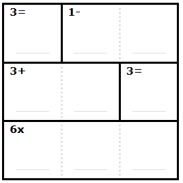
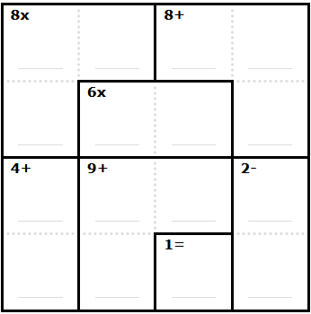

# CISC/CMPE 204 Modelling Project - Kenken Board Analyzer

The purpose of this project is to read an NxN Kenken board configuration and provide the user information on:
1. If it is a valid Kenken board configuration. 
    * For the board to be considered valid there must be **one and only one** viable solution. For a solution to be viable the rows and columns all must contain the numbers 1-N without repeats, and the numbers in the bolded squares (referred to as regions) must produce the arithmetic result using the operator specified for the cage. For the full rules to Kenken you can read more [here](https://www.puzzazz.com/how-to/kenken).
2. The suggested difficulty for the board configuration.
3. A visual representation of the board solution.

All the developed code for the project can be found in run.py. One-hot encoding is used with booleans to represent the possible inputs of 1-N in each of the kenken square, with each bit represented by a nnf variable. For more information of model implementation, please read the documentation in documents/final.

Five example board configurations have been included in run.py. Example corresponding board configurations are shown below for:

Board config #2 (3x3):

Board config #5 (4x4):

## Structure

* `documents`: Contains folders for both of your draft and final submissions. README.md files are included in both.
* `run.py`: General wrapper script that executes the test_kenken function. Runs auto-checks using the model produced by test_kenken.
* `test.py`: Run this file to confirm that your submission has everything required. This essentially just means it will check for the right files and sufficient theory size.
* `finalProofs.jp` : This contains the JAPE sequents we are proposing to prove. 
* `modelling_project.pdf` : This contains the final report for the project. 
